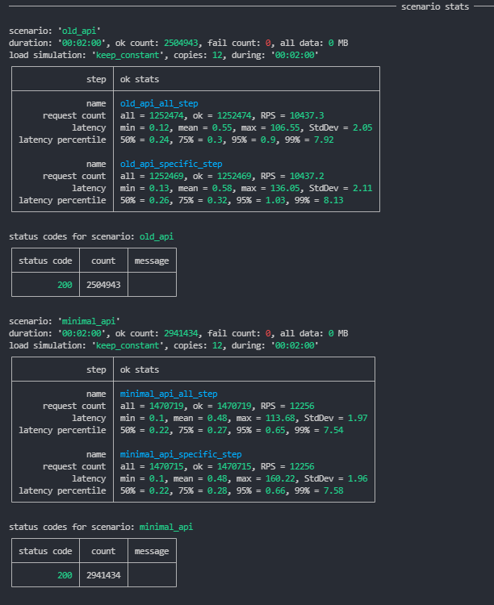

# Old vs new minimal API style

Stress tests of 'old' controller based approach, typical for .NET web APIs, and new 'minimal' web API introduced in .NET 6.

Both apps use same contracts and are functionally the same.

Tests done with [NBomber](https://github.com/PragmaticFlow/NBomber).

## Prerequisites

* .NET 6 SDK

## Results

Stress test results showing 'minimal' API being faster (17% request per second performance increase from controller-styled app).  

